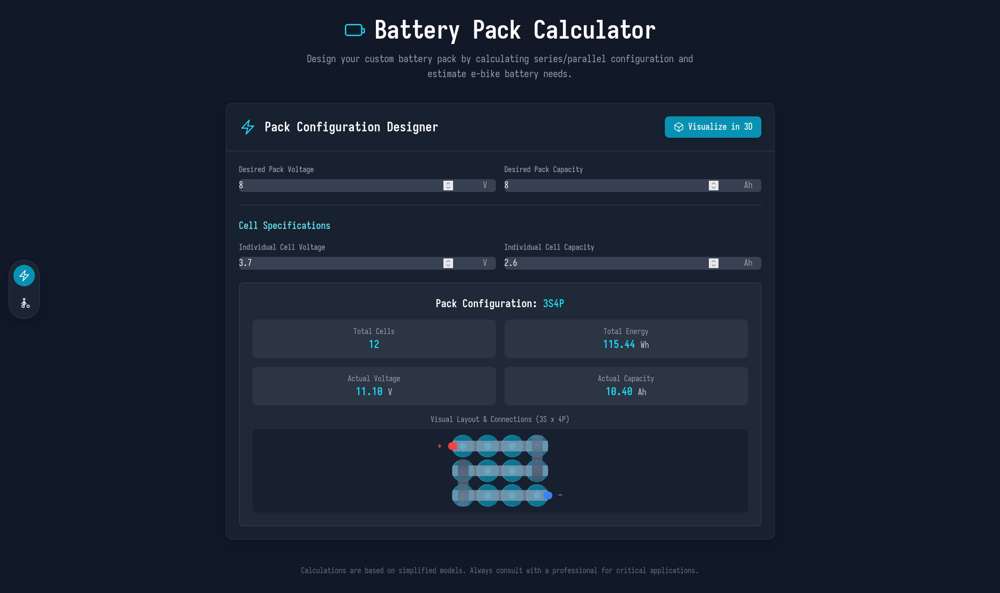
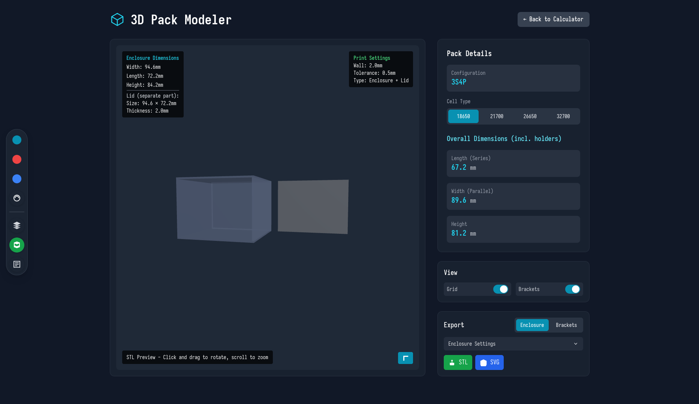
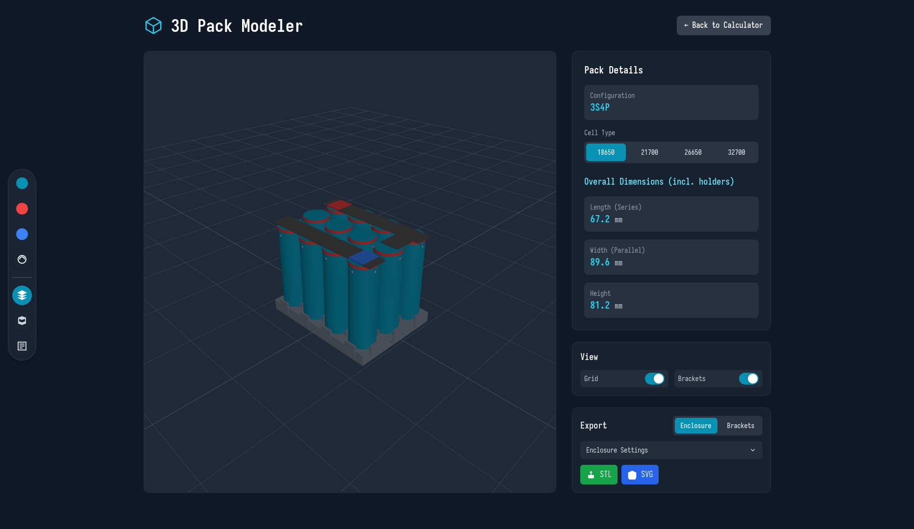
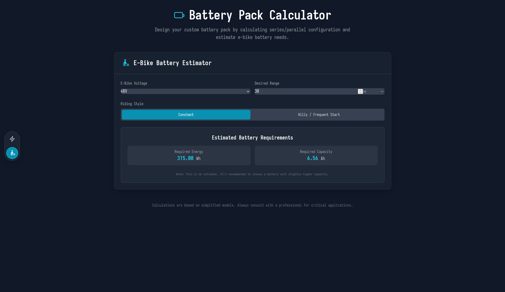

# Battery Pack Visualizer

A React TypeScript application for calculating and visualizing battery pack configurations with 3D modeling capabilities. Calculate optimal pack layouts for general use or e-bike applications, then generate 3D models with STL export for 3D printing.

## ⚠️ Important Disclaimer

**This tool is for educational and prototyping purposes only.** Battery pack design involves complex electrical, thermal, and safety considerations that this calculator does not fully address. The calculations and models provided:

- Are based on simplified assumptions and may not reflect real-world conditions
- Do not account for battery chemistry variations, temperature effects, or aging
- Should not be used as the sole basis for commercial or safety-critical applications
- May contain inaccuracies in calculations, dimensions, or 3D models

**Always consult with qualified electrical engineers and follow proper battery safety protocols when designing actual battery packs.** Lithium-ion batteries can be dangerous if mishandled.

## Features

- **Battery Pack Calculator**: Calculate series/parallel configurations for desired voltage and capacity
- **E-bike Range Estimator**: Specialized calculator for electric bike applications
- **3D Visualization**: Interactive Three.js models with realistic battery cell rendering
- **Export Capabilities**: Generate STL files for 3D printing battery holders and enclosures
- **Multiple Cell Types**: Support for 18650, 21700, 26650, and 32700 battery cells
- **SVG Layout Export**: 2D technical drawings with precise dimensions

## Screenshots

### Battery Pack Calculator - Main Interface

*Main calculator interface with dual mode: general battery pack configuration and specialized e-bike range estimator with riding style options.*

### 3D Pack Modeler - STL Preview Mode

*Interactive 3D modeling with STL preview for 3D printing. Shows enclosure dimensions, print settings, and export capabilities.*

### 3D Visualization Mode

*Real-time 3D battery pack visualization with interactive controls, realistic rendering, and color-coded positive/negative terminals.*

### E-bike Range Estimator

*Specialized calculator for electric bike applications with range estimation based on riding conditions, terrain, and riding style.*

## Tech Stack

- React 19 with TypeScript
- Three.js for 3D rendering
- Vite for build tooling
- Tailwind CSS for styling

## Run Locally

**Prerequisites:** Node.js and pnpm


1. Install dependencies:
   ```bash
   pnpm install
   ```
2. (Optional) Set the `GEMINI_API_KEY` in [.env.local](.env.local) for AI features
3. Run the development server:
   ```bash
   pnpm dev
   ```
4. Open [http://localhost:5173](http://localhost:5173) in your browser

## Build for Production

```bash
pnpm build
pnpm preview  # Test production build locally
```

## Usage

1. **Calculator**: Enter desired voltage and capacity to get optimal series/parallel configuration
2. **E-bike Mode**: Use specialized calculator with range estimation based on riding style
3. **3D Modeler**: Visualize your battery pack in 3D with realistic rendering
4. **Export**: Generate STL files for 3D printing holders or complete enclosures
5. **Layout**: Export SVG technical drawings with precise measurements
